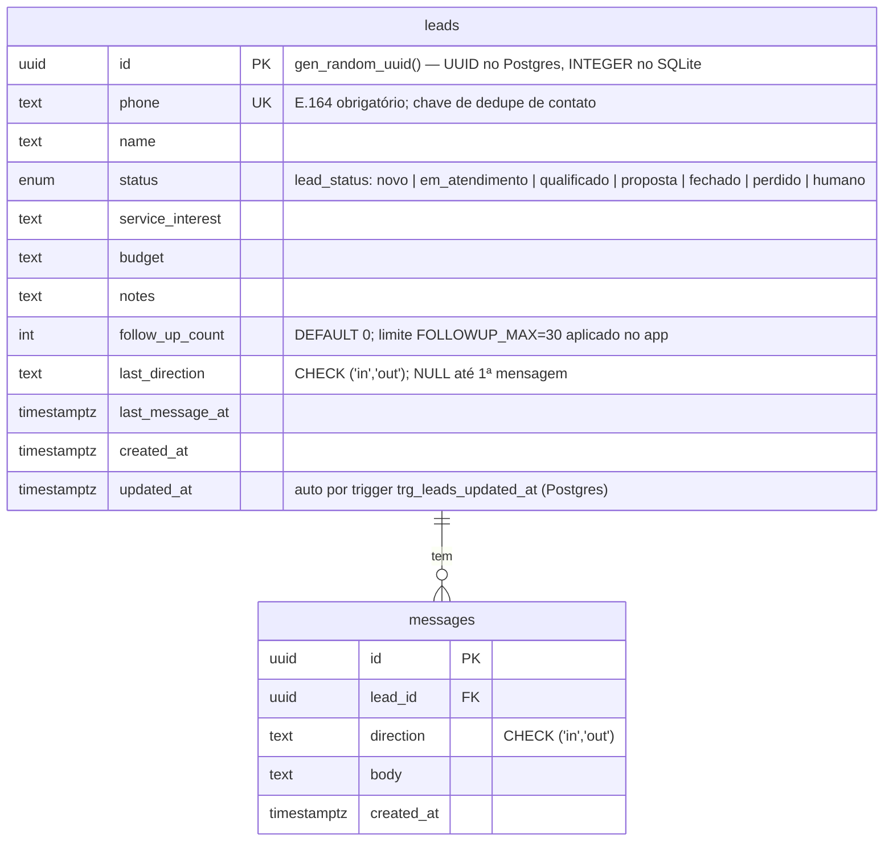

# Schema do Banco de Dados — CRM WhatsApp

Fonte de verdade do modelo de dados. Cobre os dois níveis de persistência do projeto:
- **Protótipo** — SQLite via `src/db.ts` (Node 22.5+ `node:sqlite`)
- **Produção** — Supabase (Postgres) via `supabase/schema.sql`

Relacionado: [[project/architecture]] · [[agents/data-engineer/migrations-log]]

---

## Diagrama ER (Mermaid)



> No SQLite: tipos são TEXT/INTEGER; sem ENUM, sem CHECK explícito em `status`/`direction`, sem ON DELETE CASCADE, IDs são INTEGER AUTOINCREMENT.

---

## Entidades

### `leads`

Entidade central. Representa um contato que chegou pelo WhatsApp e está num estágio do funil.

| Coluna            | Tipo (Postgres)          | Tipo (SQLite) | Nulável | Default            | Notas |
|-------------------|--------------------------|---------------|---------|--------------------|-------|
| `id`              | `uuid` PK                | `INTEGER` PK  | não     | `gen_random_uuid()`| AUTOINCREMENT no SQLite |
| `phone`           | `text` UNIQUE NOT NULL   | `TEXT` UNIQUE | não     | —                  | Chave de dedupe; deve ser E.164 |
| `name`            | `text`                   | `TEXT`        | sim     | NULL               | Coletado pelo agente |
| `status`          | `lead_status` NOT NULL   | `TEXT` NOT NULL| não    | `'novo'`           | ENUM no Postgres; TEXT livre no SQLite |
| `service_interest`| `text`                   | `TEXT`        | sim     | NULL               | Qualificação: serviço desejado |
| `budget`          | `text`                   | `TEXT`        | sim     | NULL               | Qualificação: orçamento |
| `notes`           | `text`                   | `TEXT`        | sim     | NULL               | Anotações livres do agente |
| `follow_up_count` | `int` NOT NULL           | `INTEGER` NOT NULL| não  | `0`               | Contador de retomadas; zerado quando lead responde (`resetFollowUp`) |
| `last_direction`  | `text` CHECK ('in','out')| `TEXT`        | sim     | NULL               | Direção da última mensagem; orienta motor de follow-up |
| `last_message_at` | `timestamptz`            | `TEXT`        | sim     | NULL               | ISO string no SQLite; TIMESTAMPTZ no Postgres |
| `created_at`      | `timestamptz` NOT NULL   | `TEXT` NOT NULL| não    | `now()`            | |
| `updated_at`      | `timestamptz` NOT NULL   | `TEXT` NOT NULL| não    | `now()`            | Atualizado por trigger (Postgres) ou manualmente (SQLite) |

**Operações em `src/crm/leads.ts`:**

| Função                | O que faz |
|-----------------------|-----------|
| `findLeadByPhone`     | Busca por `phone`; base do dedupe de contato |
| `getOrCreateLead`     | Upsert por telefone; cria com `status='novo'` |
| `listLeads`           | `SELECT *` ordenado por `updated_at DESC` — usar colunas explícitas na migração para Supabase |
| `addMessage`          | Insere em `messages` + atualiza `last_direction`/`last_message_at` no lead |
| `resetFollowUp`       | Zera `follow_up_count` quando lead responde |
| `incrementFollowUp`   | Incrementa `follow_up_count`; chamado pelo scheduler de follow-up |
| `updateLeadFields`    | Partial update de `name`, `status`, `service_interest`, `budget`, `notes` |
| `setStatus`           | Wrapper para `updateLeadFields({ status })` |

---

### `messages`

Histórico completo de troca de mensagens de um lead. Cresce indefinidamente — planejar retenção.

| Coluna      | Tipo (Postgres)                     | Tipo (SQLite)     | Nulável | Default | Notas |
|-------------|-------------------------------------|-------------------|---------|---------|-------|
| `id`        | `uuid` PK                           | `INTEGER` PK      | não     | `gen_random_uuid()` | AUTOINCREMENT no SQLite |
| `lead_id`   | `uuid` NOT NULL FK → `leads.id`     | `INTEGER` NOT NULL FK | não | —  | ON DELETE CASCADE no Postgres; ausente no SQLite |
| `direction` | `text` CHECK ('in','out') NOT NULL  | `TEXT` NOT NULL   | não     | —       | `'in'` = mensagem do lead; `'out'` = resposta do agente/humano |
| `body`      | `text` NOT NULL                     | `TEXT` NOT NULL   | não     | —       | Conteúdo da mensagem |
| `created_at`| `timestamptz` NOT NULL              | `TEXT` NOT NULL   | não     | `now()` | |

**Gap crítico:** não há campo `external_id` (ex: ID da mensagem na Evolution API / Make). Sem ele, webhooks duplicados (Make pode reenviar) inserem mensagens repetidas. Ver [[#gaps-e-riscos]].

---

## Estágios do Funil (`lead_status`)

Definido em `src/types.ts` e espelhado como ENUM `lead_status` no Postgres.

| Valor           | Label            | Agente IA responde? | Descrição |
|-----------------|------------------|---------------------|-----------|
| `novo`          | Novo             | sim                 | Lead acabou de chegar; agente inicia atendimento |
| `em_atendimento`| Em atendimento   | sim                 | Conversa em curso |
| `qualificado`   | Qualificado      | sim                 | Agente coletou serviço + orçamento |
| `proposta`      | Proposta         | não                 | Proposta enviada; aguarda retorno |
| `fechado`       | Fechado          | não                 | Virou cliente |
| `perdido`       | Perdido          | não                 | Não avançou |
| `humano`        | Atend. humano    | não                 | Humano assumiu; agente pausado |

`AUTO_STATUSES = ['novo', 'em_atendimento', 'qualificado']` — apenas nesses estágios o agente de IA responde automaticamente.

---

## Índices

### Existentes no Postgres (`supabase/schema.sql`)

| Nome                    | Tabela     | Colunas / Condição                                               | Propósito |
|-------------------------|------------|------------------------------------------------------------------|-----------|
| `idx_messages_lead`     | `messages` | `(lead_id)`                                                      | Busca histórico de conversa |
| `idx_leads_status`      | `leads`    | `(status)`                                                       | Filtro por estágio no dashboard/kanban |
| `idx_leads_followup`    | `leads`    | `(status, last_direction, last_message_at) WHERE last_direction = 'out'` | Motor de follow-up; acha leads sem resposta |

### Existentes no SQLite

| Nome                | Tabela     | Colunas      |
|---------------------|------------|--------------|
| `idx_messages_lead` | `messages` | `(lead_id)`  |

### Índices recomendados (ainda ausentes)

| Coluna / Expressão        | Justificativa |
|---------------------------|---------------|
| `leads(phone)`            | Busca de dedupe `findLeadByPhone` é O(log n) com índice; hoje depende do UNIQUE (que cria índice implícito — OK) |
| `messages(external_id)`   | Necessário após adicionar campo de idempotência |
| `leads(follow_up_count)`  | Útil quando filtrar leads próximos do limite FOLLOWUP_MAX=30 |

---

## RLS (Row-Level Security)

**Situação atual:** RLS comentado no schema de produção.

```sql
-- alter table leads enable row level security;
-- alter table messages enable row level security;
```

**Decisão documentada no schema:** funções serverless (Vercel) acessam via `service_role`, que ignora RLS — correto para o backend. RLS deve ser habilitado **somente** quando o dashboard front-end fizer queries diretas ao Supabase com Supabase Auth.

**Quando habilitar (roadmap):**
```sql
ALTER TABLE leads   ENABLE ROW LEVEL SECURITY;
ALTER TABLE messages ENABLE ROW LEVEL SECURITY;

-- Policy inicial: usuário autenticado vê somente seus próprios leads
-- (adaptar quando houver multi-tenant / equipes)
CREATE POLICY "agente_acessa_proprios_leads" ON leads
  FOR ALL USING (auth.uid() IS NOT NULL);
```

---

## Diferenças SQLite (Protótipo) × Supabase/Postgres (Produção)

| Aspecto                  | SQLite (src/db.ts)                      | Postgres (supabase/schema.sql)                   |
|--------------------------|-----------------------------------------|--------------------------------------------------|
| PK de `leads`            | `INTEGER AUTOINCREMENT`                 | `UUID DEFAULT gen_random_uuid()`                 |
| PK de `messages`         | `INTEGER AUTOINCREMENT`                 | `UUID DEFAULT gen_random_uuid()`                 |
| Tipo de `id` em `Lead`   | `number` (types.ts)                     | Deve ser `string` após migração                  |
| `status` em `leads`      | `TEXT` livre                            | `lead_status` ENUM — erros capturados pelo banco |
| Constraints em `direction`/`last_direction` | Ausentes            | `CHECK ('in','out')`                             |
| ON DELETE CASCADE        | Ausente em `messages`                   | `messages.lead_id` → `ON DELETE CASCADE`         |
| Timestamps               | `TEXT` ISO string                       | `TIMESTAMPTZ`                                    |
| Trigger `updated_at`     | Atualizado manualmente em cada UPDATE   | Trigger `trg_leads_updated_at` automático        |
| Índices extras           | Apenas `idx_messages_lead`              | + `idx_leads_status`, `idx_leads_followup`       |
| WAL mode                 | `PRAGMA journal_mode = WAL`             | N/A (Postgres nativo)                            |
| RLS                      | N/A                                     | Comentado; pronto para habilitar                 |

**Impacto na migração de tipos (`src/types.ts`):** `Lead.id` e `Message.id` são `number` no protótipo. Após migrar para Supabase, devem ser `string` (UUID). `Message.lead_id` também passa de `number` para `string`.

---

## Idempotência de Mensagens

**Problema:** Make.com e a Evolution API podem reenviar o mesmo webhook. Sem deduplicação, a mesma mensagem do lead é inserida múltiplas vezes em `messages`, disparando múltiplas respostas do agente.

**Solução necessária** (não implementada no schema atual):

```sql
ALTER TABLE messages ADD COLUMN external_id text;
CREATE UNIQUE INDEX idx_messages_external_id ON messages(external_id)
  WHERE external_id IS NOT NULL;
```

No handler (`/api/webhook`), antes de inserir:
```sql
INSERT INTO messages (lead_id, direction, body, external_id)
VALUES ($1, 'in', $2, $3)
ON CONFLICT (external_id) DO NOTHING;
```

O `external_id` vem do payload do Make (ID da mensagem na Evolution/WhatsApp).

---

## Follow-up (até 30 retomadas)

`follow_up_count` em `leads` controla o número de retomadas automáticas enviadas sem resposta do lead.

**Fluxo:**
1. Agente envia mensagem (`direction='out'`) → `last_direction = 'out'`.
2. Cron (`/api/cron/followup`) busca leads onde `last_direction = 'out'` e `last_message_at < now() - FOLLOWUP_INTERVAL` e `follow_up_count < FOLLOWUP_MAX`.
3. Se `follow_up_count >= FOLLOWUP_MAX` → lead vai para `status='perdido'`.
4. Lead responde → `resetFollowUp` zera `follow_up_count`.

O índice parcial `idx_leads_followup` foi criado exatamente para a query do cron — eficiente.

**Gap:** `follow_up_count < 30` não tem CHECK constraint no banco. O limite é puramente aplicacional (`FOLLOWUP_MAX` env var). Risco: bug no scheduler pode ultrapassar o limite sem erro de banco.

---

## Gaps e Riscos

| # | Gap / Risco | Severidade | Solução Recomendada |
|---|-------------|------------|---------------------|
| 1 | ~~Sem `external_id` em `messages`~~ — **RESOLVIDO Story 1.1** (SQLite: `INSERT OR IGNORE` + índice parcial; Supabase: pendente Story 2.1 com `ON CONFLICT DO NOTHING`) | Alta | ✅ |
| 2 | ~~`Lead.id` é `number` em `types.ts`~~ — **RESOLVIDO Story 1.2** (`id: string` em `Lead`/`Message`; SQLite usa TEXT PKs + `randomUUID()`; Supabase usa `gen_random_uuid()`) | Alta | ✅ |
| 3 | **`listLeads` usa `SELECT *`** — viola convenção e é frágil contra adição de colunas | Média | Especificar colunas explícitas no rewrite para Supabase |
| 4 | **Qualificação como campos livres em `leads`** — `service_interest` e `budget` são `text` livre; sem histórico de qualificações, sem snapshot de raciocínio do agente | Média | Considerar tabela `qualifications` separada com JSON de critérios e score |
| 5 | **Sem tabela `conversations`** — mensagens diretamente sob `leads` impede multi-sessão, multi-canal ou retomadas explícitas | Baixa (v1) | Planejar para v2 com suporte a múltiplos canais |
| 6 | **Sem rastreio de custo/tokens do agente** — impossível monitorar gasto por lead ou conversa | Baixa (v1) | Adicionar `model`, `input_tokens`, `output_tokens` em `messages` ou em tabela `llm_calls` |
| 7 | **`follow_up_count` sem CHECK no banco** — limite de 30 só existe na app | Baixa | `ADD CONSTRAINT chk_followup CHECK (follow_up_count >= 0)` + documentar o limite |
| 8 | **RLS desabilitado** — se o front-end der query direta ao Supabase sem service_role, dados de todos os leads ficam expostos | Alta (quando dashboard for ao ar com Supabase Auth) | Habilitar RLS + criar policies antes de expor queries ao front |
| 9 | **ON DELETE CASCADE ausente no SQLite** — exclusão de lead não cascateia mensagens no protótipo | Baixa (SQLite é só dev) | Irrelevante para produção |
| 10 | **Sem índice em `leads(phone)`** explícito | Baixa | O UNIQUE já cria implicitamente — OK, mas documentar |
