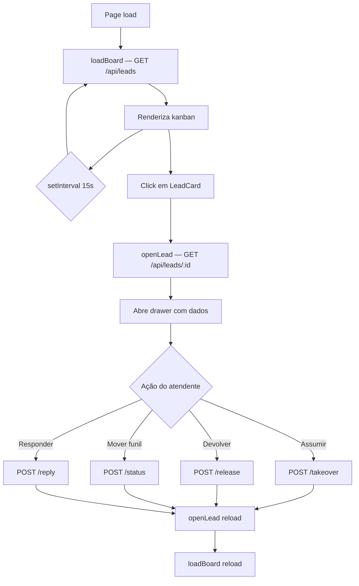
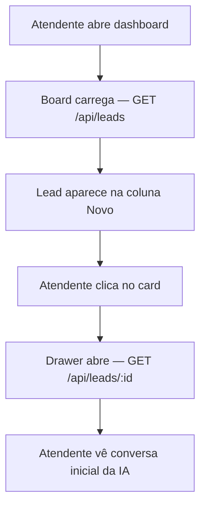
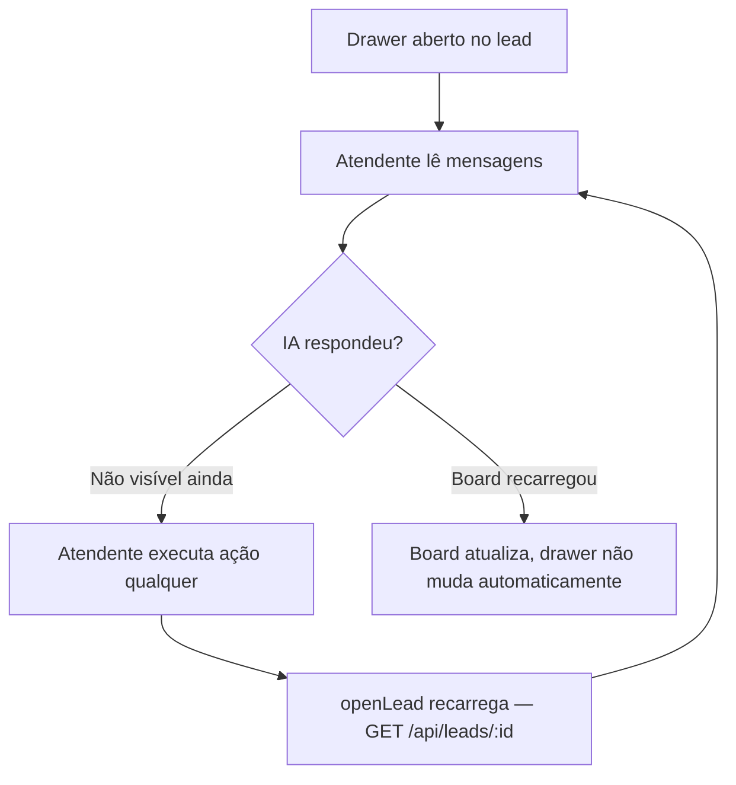
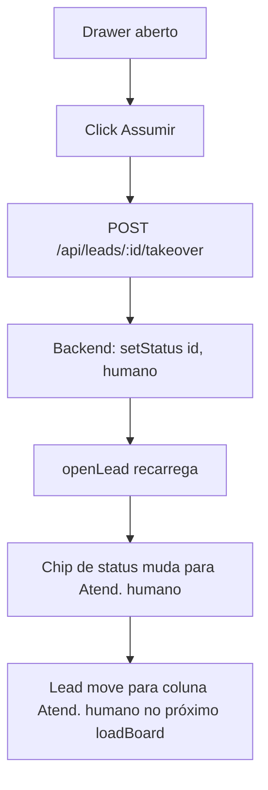
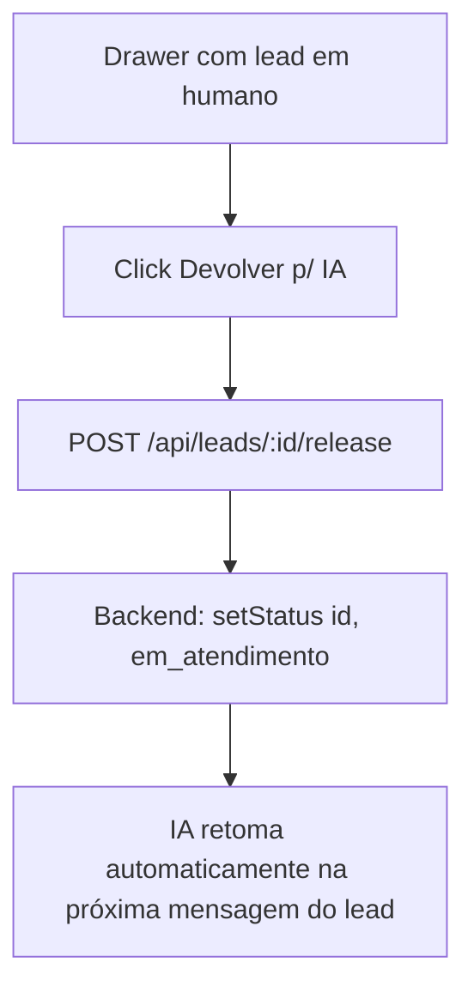
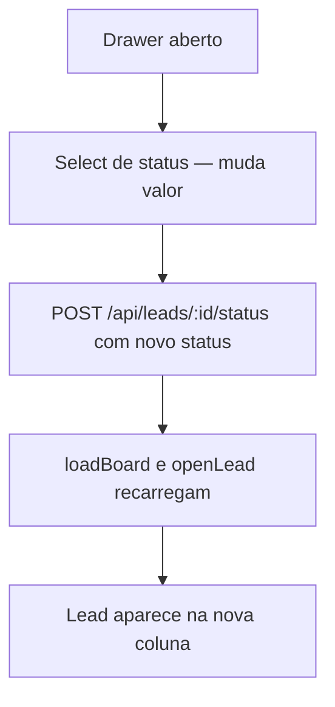
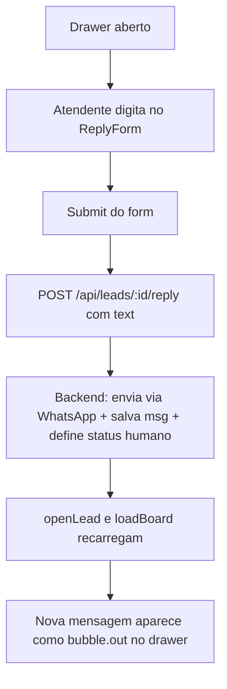

# Catálogo UX — Dashboard CRM WhatsApp

> Discovery realizado em 2026-06-25 com base nos arquivos `public/index.html`, `public/app.js`, `public/styles.css` e `src/routes/api.ts`.
> Estado atual: **dashboard funcional mínimo** — SPA vanilla JS/CSS/HTML sem framework, tema escuro, totalmente operacional para o fluxo de atendimento, mas com gaps críticos para produção.

---

## Telas / Vistas

O dashboard é uma **Single Page Application** (sem roteamento). Há uma única rota `/` que carrega o kanban. O painel lateral (drawer) é um overlay fixo — não é uma página separada.

```
┌─────────────────────────────────────────────────────────────────────────────┐
│  CRM WhatsApp · primeiro atendimento por IA          [↻ Atualizar]          │
├─────────────────────────────────────────────────────────────────────────────┤
│                                                                             │
│  ┌──────────┐ ┌──────────────┐ ┌──────────────┐ ┌──────────┐ ...          │
│  │  Novo    │ │Em atendimento│ │  Qualificado │ │ Proposta │              │
│  │ (N)      │ │   (N)        │ │    (N)       │ │   (N)    │              │
│  │          │ │              │ │              │ │          │              │
│  │ ┌──────┐ │ │ ┌──────┐    │ │ ┌──────┐    │ │          │              │
│  │ │ Card │ │ │ │ Card │    │ │ │ Card │    │ │          │              │
│  │ └──────┘ │ │ └──────┘    │ │ └──────┘    │ │          │              │
│  └──────────┘ └──────────────┘ └──────────────┘ └──────────┘              │
│                                                                             │
└─────────────────────────────────────────────────────────────────────────────┘

Com drawer aberto (overlay fixo à direita, 440px):

┌──────────────────────────────┐ ┌──────────────────────────────────────────┐
│  Kanban (parcialmente visível│ │  Nome do Lead                         [✕]│
│  + bloqueado por overlay)    │ ├──────────────────────────────────────────┤
│                              │ │  [Em atendimento] [Serviço] [💰 Budget] │
│                              │ ├──────────────────────────────────────────┤
│                              │ │  [🙋 Assumir] [🤖 Devolver p/ IA]      │
│                              │ │  [select: Mover funil ▾]                │
│                              │ ├──────────────────────────────────────────┤
│                              │ │  📝 Notes (se existir)                  │
│                              │ ├──────────────────────────────────────────┤
│                              │ │  ┌────────────────────────────────────┐ │
│                              │ │  │ Mensagem recebida (in)             │ │
│                              │ │  └────────────────────────────────────┘ │
│                              │ │       ┌────────────────────────────────┐ │
│                              │ │       │ Mensagem enviada (out)         │ │
│                              │ │       └────────────────────────────────┘ │
│                              │ ├──────────────────────────────────────────┤
│                              │ │  [Responder como humano…]  [Enviar]     │
└──────────────────────────────┘ └──────────────────────────────────────────┘
```

---

## Componentes Existentes

### Topbar

**Propósito:** Identificação da aplicação e ação de refresh manual.

**Estados:** Default apenas.

**Props (renderizado estático no HTML):**
| Elemento | Tipo | Descrição |
|---|---|---|
| h1 | estático | "CRM WhatsApp · primeiro atendimento por IA" |
| #refresh | button | Dispara `loadBoard()` (reload do kanban) |

**Acessibilidade:**
- Botão `#refresh` sem `aria-label` — o texto "↻ Atualizar" é suficiente, mas o caractere seta (↻) pode ser lido por leitores como "seta de reciclagem".
- Sem `role="banner"` explícito (o `<header>` já implica isso — ok).

**Gap:** Sem indicador visual de "last updated at HH:MM" — operador não sabe quando foi a última sincronização.

---

### KanbanBoard

**Propósito:** Visualização do pipeline de leads em colunas por estágio. Ponto de entrada principal do fluxo de atendimento.

**Colunas (em ordem fixada em `app.js`):**

```
novo → em_atendimento → qualificado → proposta → fechado → perdido → humano
```

Renderizado dinamicamente via `loadBoard()` que chama `GET /api/leads`.

**Estados:**
- Default: colunas com cards
- Empty: coluna com header mas sem cards (sem feedback visual de "vazio" — apenas espaço em branco)
- Loading: sem skeleton / spinner — board apaga e redesenha (flash de conteúdo)

**Props:**
| Prop | Tipo | Descrição |
|---|---|---|
| leads[] | Lead[] | Lista vinda de `GET /api/leads` |
| statusLabels | Record | Mapeamento status → label (também vindo da API) |

**Acessibilidade:**
- `<main id="board" class="board">` — role main implícito, ok.
- Colunas sem `aria-label` ou `role="list"`.
- Nenhuma navegação por teclado — apenas click.

**Responsivo:** Usa `grid-auto-flow: column` com `grid-auto-columns: 280px` e `overflow-x: auto`. Funciona em desktop (scroll horizontal). Em mobile (< 440px) o layout colapsa ilegível — sem breakpoints.

---

### LeadCard

**Propósito:** Representação compacta de um lead dentro de uma coluna do kanban. Click abre o drawer.

**Estados:**
- Default: exibe nome/phone + timestamp + serviço de interesse
- Hover: border-color muda para `--accent2` (#3b82f6 azul) — feedback visual presente
- Active: sem estado visual — click dispara `openLead(id)` imediatamente
- Follow-up: exibe badge "⏳ N retomada(s) enviada(s)" em âmbar quando `last_direction === "out" && follow_up_count > 0`

**Informações exibidas:**
```
┌──────────────────────────────────────┐
│ Nome do Lead (ou telefone se sem nome)│
│ +55 11 9xxxx · DD/MM HH:MM          │
│ ▸ Serviço de interesse              │
│ ⏳ 2 retomada(s) enviada(s)         │  ← condicional
└──────────────────────────────────────┘
```

**Props:**
| Prop | Tipo | Descrição |
|---|---|---|
| l.name | string\|null | Nome do lead (fallback: l.phone) |
| l.phone | string | Telefone WhatsApp |
| l.last_message_at | string\|null | Timestamp da última mensagem (ISO-like) |
| l.service_interest | string\|null | Serviço de interesse (opcional) |
| l.follow_up_count | number | Quantas retomadas foram enviadas |
| l.last_direction | "in"\|"out"\|null | Direção da última mensagem |

**Acessibilidade:**
- Div com `onclick` — sem `role="button"`, sem `tabindex="0"`, sem `onkeydown`. Inacessível por teclado.
- Sem `aria-label` descrevendo o lead.

**Gap:** Sem indicador de "não lido" (badge de new / unseen). Sem prioridade visual por urgência.

---

### LeadDrawer (Painel Lateral)

**Propósito:** Detalhe do lead + histórico completo de conversa + ações do atendente. Overlay fixo à direita.

**Estados:**
- Hidden: `display: none` via classe `.hidden`
- Open: exibido após click em LeadCard
- Carregando dados: sem loading state — dados aparecem quando fetch resolve

**Subcomponentes internos:**

#### DrawerHeader
```
┌──────────────────────────────────────────┐
│ Nome do Lead                          [✕]│
│ +55 11 9xxxx                            │
└──────────────────────────────────────────┘
```
- h2 com nome, div com telefone, botão ghost "✕" que fecha

#### MetaChips
```
[Em atendimento]  [Serviço de interesse]  [💰 Budget]
```
- `#d-status`: chip azul com status atual do funil
- `#d-service`: chip light com serviço de interesse (vazio se null)
- `#d-budget`: chip light com budget (vazio se null)
- Chips vazios ficam invisíveis via `chip:empty { display: none }`

#### ActionBar
```
[🙋 Assumir]  [🤖 Devolver p/ IA]  [Mover para ▾]
```
- Botão **Assumir**: `POST /api/leads/:id/takeover` → define status "humano"
- Botão **Devolver p/ IA**: `POST /api/leads/:id/release` → define status "em_atendimento"
- Select **Mover funil**: `POST /api/leads/:id/status` com status selecionado

**Estados dos botões:**
- Sem disabled state — "Assumir" aparece mesmo se já "humano"; "Devolver" aparece mesmo se já em atendimento por IA. Sem validação visual de ação inaplicável.

#### NotesBox
- Visível apenas se `lead.notes` for não-nulo
- Texto estático, não editável inline (apenas via `POST /edit` — não exposto no dashboard atual)

#### MessageThread
**Propósito:** Histórico completo de mensagens do lead.

```
┌────────────────────────────────────┐
│ Mensagem recebida (in) — fundo     │
│ escuro, alinhada à esquerda        │
│                         DD/MM HH:MM│
└────────────────────────────────────┘

         ┌──────────────────────────────────┐
         │ Mensagem enviada (out)           │
         │ (IA ou humano — não diferenciado)│
         │                     DD/MM HH:MM  │
         └──────────────────────────────────┘
```

- `bubble.in` — mensagem do lead (fundo `--panel2` / escuro)
- `bubble.out` — mensagem enviada (fundo `#0b5e3a` / verde escuro, similar ao WhatsApp)
- `white-space: pre-wrap` preserva quebras de linha
- `box.scrollTop = box.scrollHeight` rola para o final automaticamente

**Gap crítico:** Mensagens `out` não diferenciam se foram enviadas pela IA ou pelo operador humano. Não há rótulo "IA" vs "Atendente".

#### ReplyForm
```
┌──────────────────────────────────────────────┐
│ [Responder como humano…              ] [Enviar]│
└──────────────────────────────────────────────┘
```
- `POST /api/leads/:id/reply` com `{ text }` no body
- Ao enviar: coloca lead em "humano" automaticamente (backend)
- Após envio: recarrega drawer + board

**Acessibilidade do Drawer:**
- Sem `role="dialog"`, sem `aria-modal`, sem focus trap
- Sem `aria-labelledby` apontando para o h2
- Botão fechar "✕" sem `aria-label`
- Input de reply sem `<label>` associado (tem placeholder, mas não é substituto de label)
- `#d-messages` sem `aria-live="polite"` — mensagens novas não são anunciadas por leitores de tela

---

## Consumo de API

### Endpoints

| Método | Endpoint | Quando chamado | Retorno |
|---|---|---|---|
| GET | `/api/leads` | loadBoard() — init + polling 15s + botão refresh | `{ leads: Lead[], statusLabels: Record }` |
| GET | `/api/leads/:id` | openLead(id) — ao clicar no card | `{ lead: Lead, messages: Message[] }` |
| POST | `/api/leads/:id/reply` | Submit do ReplyForm | `{ ok: true }` |
| POST | `/api/leads/:id/status` | Change do StatusSelect | `{ ok: true }` |
| POST | `/api/leads/:id/takeover` | Click "Assumir" | `{ ok: true }` |
| POST | `/api/leads/:id/release` | Click "Devolver p/ IA" | `{ ok: true }` |

### Estratégia de atualização



**Mecanismo:** Polling ativo (`setInterval` de 15s). Não há SSE nem WebSocket. O drawer aberto **não** se auto-atualiza — só o board recarrega a cada 15s. Para ver mensagens novas no drawer, o atendente precisa executar uma ação (ou fechar e reabrir o lead).

---

## Fluxos de UX do Atendente

### 1. Ver lead novo



**Delay máximo:** 15 segundos (polling interval) entre chegada do lead e aparição no board.

### 2. Acompanhar conversa da IA



**Problema:** Não há atualização automática do drawer — atendente depende de ação manual ou de executar uma ação (reply, takeover, etc.) para ver mensagens novas da IA.

### 3. Assumir atendimento



**Efeito na IA:** Backend pausa o agente (status "humano" não está em `AUTO_STATUSES`).

### 4. Devolver para IA



### 5. Mover lead no funil



**Problema de UX:** Não há drag-and-drop entre colunas. O único jeito de mover lead no funil é abrir o drawer e usar o select.

### 6. Responder como humano



---

## Gaps de UX e Oportunidades para Produção

### Críticos (bloqueiam lançamento)

| # | Gap | Impacto | Recomendação |
|---|---|---|---|
| G1 | **Autenticação ausente** | Dashboard completamente público — qualquer URL tem acesso a todos os leads e conversas | Adicionar auth (NextAuth, Supabase Auth ou middleware JWT) antes de publicar na Vercel |
| G2 | **Sem distinção IA vs. humano nas mensagens** | Atendente não sabe se mensagem foi enviada pela IA ou por outro operador humano | Adicionar campo `sender` ou `is_ai` nas mensagens; renderizar rótulo "IA" vs. "Você" nas bubbles |
| G3 | **Drawer sem foco trap / ARIA dialog** | Usuários de teclado ficam presos fora do drawer ou não sabem que ele abriu | `role="dialog"`, `aria-modal="true"`, focus trap, `aria-labelledby` |

### Importantes (degradam experiência em produção)

| # | Gap | Impacto | Recomendação |
|---|---|---|---|
| G4 | **Polling de 15s sem feedback** | Lead novo demora até 15s para aparecer; atendente não sabe quando board foi atualizado | Substituir por SSE (`EventSource`) ou WebSocket; exibir "Atualizado às HH:MM" no topbar |
| G5 | **Drawer não auto-atualiza** | Atendente não vê novas mensagens da IA sem executar outra ação | Polling específico do drawer (3-5s) quando aberto, ou SSE para push de mensagens |
| G6 | **Cards inacessíveis por teclado** | Navegação de teclado impossível no kanban | `tabindex="0"`, `role="button"`, `onkeydown` (Enter/Space) nos cards |
| G7 | **Sem loading state / feedback de erro** | Ação falha silenciosamente — operador não sabe se request funcionou | Spinner/disable no botão durante POST; toast de erro se request falhar |
| G8 | **Sem drag-and-drop no kanban** | Mover lead requer abrir drawer + usar select | Implementar DnD (API nativa ou lib leve) para arrastar cards entre colunas |

### Moderados (melhoram qualidade)

| # | Gap | Impacto | Recomendação |
|---|---|---|---|
| G9 | **Sem badge "não lido"** | Leads com novas mensagens não se diferenciam visualmente | Badge counter ou borda colorida no card quando há mensagem nova não visualizada |
| G10 | **Botões Assumir/Devolver sem estado contextual** | "Assumir" aparece mesmo se já assumido; "Devolver" aparece mesmo se já IA | Desabilitar (disabled) ou ocultar botão inaplicável conforme status atual |
| G11 | **Sem busca/filtro** | Com volume de leads, encontrar lead específico é impossível | Campo de busca no topbar filtrado por nome ou telefone |
| G12 | **Sem responsividade mobile** | Layout quebra em telas < 440px (drawer ocupa 95vw mas kanban fica inacessível) | Breakpoint mobile: drawer fullscreen, kanban oculto quando drawer aberto |
| G13 | **Contraste --muted não verificado** | `#8b93a3` sobre `#0f1115` — ratio provável ~5.5:1 (passar AA) mas `font-size: 11-12px` em alguns elementos pode cair abaixo de AA Large | Auditoria com ferramenta (axe-core) especialmente nos textos menores |
| G14 | **Sem indicador de próximo follow-up** | Card mostra count de retomadas mas não quando a próxima será disparada | Exibir timestamp do próximo follow-up agendado no card |
| G15 | **ReplyForm sem label acessível** | Input tem placeholder mas não `<label>` associado | `<label for="d-reply-text">Responder como humano</label>` (visualmente oculto via sr-only) |
| G16 | **Flash de conteúdo no reload do board** | `board.innerHTML = ""` antes de popular — board pisca a cada 15s | Diffing incremental ou opacidade transitória no reload |

---

## Design System Atual

| Token | Valor | Uso |
|---|---|---|
| `--bg` | `#0f1115` | Background da página |
| `--panel` | `#171a21` | Topbar, colunas do kanban, drawer |
| `--panel2` | `#1e222b` | Cards, chips light, inputs |
| `--border` | `#2a2f3a` | Bordas gerais |
| `--text` | `#e6e8ec` | Texto principal |
| `--muted` | `#8b93a3` | Texto secundário |
| `--accent` | `#25d366` | Verde WhatsApp — botões primários |
| `--accent2` | `#3b82f6` | Azul — hover cards, chip de status |

Fonte: `-apple-system, "Segoe UI", Roboto, sans-serif` (system stack — sem Google Fonts).

Sem design system formal. Variáveis CSS são base suficiente para evolução incremental.

---

## Estado do Dashboard: Funcional Mínimo

O dashboard atual cobre o **happy path do atendente**:
- Ver leads no kanban por estágio
- Abrir conversa e ler mensagens
- Assumir e devolver atendimento
- Responder como humano
- Mover lead no funil

Mas falta tudo necessário para **produção com múltiplos operadores**: autenticação, real-time, acessibilidade, feedback de ações e distinção IA/humano nas mensagens.

Ver [[shared-context]] para status atual do time. Ver [[project/architecture]] para contexto técnico do backend.
