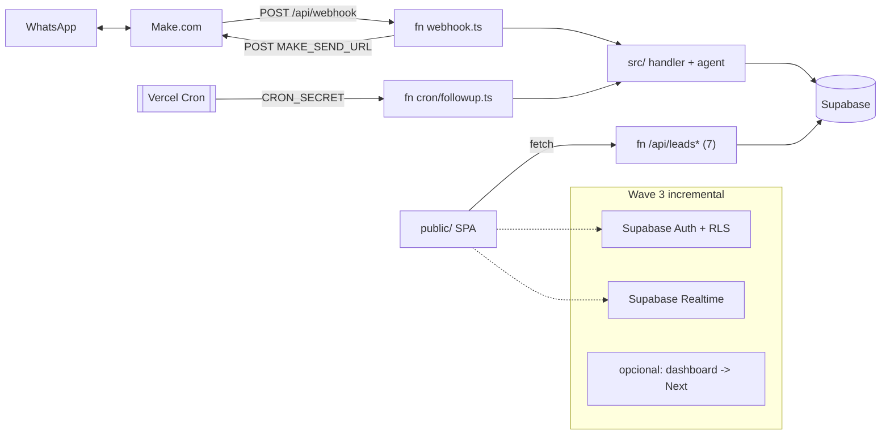

# ADR-001: Abordagem serverless na Vercel

**Status:** Proposed (aguarda confirmação do team-lead antes do crm-backend implementar)
**Destrava:** Story 3.2 (scaffold serverless), Story 3.3 (webhook), Story 3.4 (cron)

---

## Contexto

A Wave 1 (persistência → Supabase) está concluída: `crm/leads.ts` já é um repositório
**async** com assinaturas estáveis (`listLeads`, `getLead`, `addMessage`, `setStatus`,
`updateLeadFields`, etc.). A lógica de domínio (`handler.ts`, `agent/`, `followup/scheduler.ts`)
é **infra-agnóstica** — depende do repositório, não de Express nem de SQLite.

Falta sair do **Express de processo longo** (`src/index.ts` com `app.listen` + `node-cron`)
para a **Vercel serverless**. A superfície HTTP atual é pequena e já mapeada:

| Rota atual | Método | Origem |
|---|---|---|
| `/api/leads` | GET | dashboard (kanban) |
| `/api/leads/:id` | GET | dashboard (detalhe + conversa) |
| `/api/leads/:id/reply` | POST | dashboard (resposta humana) |
| `/api/leads/:id/status` | POST | dashboard |
| `/api/leads/:id/takeover` | POST | dashboard (assumir) |
| `/api/leads/:id/release` | POST | dashboard (devolver p/ IA) |
| `/api/leads/:id/edit` | POST | dashboard |
| `/webhook/evolution` | POST | canal (vai virar `/api/webhook` via Make) |
| `/health` | GET | infra |

Canal WhatsApp via **Make** como ponte: entrada `POST /api/webhook` `{ phone, name, text }`,
saída `POST {MAKE_SEND_URL} { phone, text }`. Dashboard é uma **SPA vanilla** (sem framework)
em `public/`, hoje com polling 15s.

Riscos serverless já mapeados em [[project/architecture]]: (1) cron sem processo longo,
(2) webhook fire-and-forget não sobrevive, (3) idempotência inexistente, (5) corrida no follow-up.

### Forças em jogo
- **Wave 2** = colocar a migração em produção com **mínimo risco** e rápido.
- O **webhook é síncrono e chama a Claude API** → o cold start entra na latência percebida
  pelo lead no WhatsApp. Manter esse caminho **leve** é prioridade.
- **Wave 3** (futuro) = Supabase Auth + RLS, dashboard rico, real-time, distinção IA/humano.
- Time é proficiente em vanilla JS/TS e Express; Next.js (RSC/route handlers) seria conhecimento novo.

---

## Opções consideradas

### Opção A — Funções `/api/*.ts` nativas da Vercel + dashboard estático
Cada endpoint vira uma função (`export default handler(req, res)` via `@vercel/node`),
roteamento por sistema de arquivos. Dashboard segue estático em `public/`. Vercel Cron nativo.

- **Esforço Wave 2:** Baixo–Médio. 7 handlers finos reusando `crm/leads.ts`; webhook e cron
  já têm stories próprias. `vercel.json` (cron) já existe. Dashboard não muda.
- **Risco:** Baixo. Funções independentes e stateless; padrão idiomático Vercel.
- **Cold start:** Melhor — bundle por função, o caminho do webhook não carrega o código do dashboard.
- **Fit Wave 3:** Bom. Supabase Auth/Realtime conectam direto da SPA via `supabase-js`
  (websocket ao Supabase, não precisa de Next). Migrar a UI para Next depois é incremental.
- **Isola riscos serverless:** Excelente. Webhook = 1 função síncrona; cron = Vercel Cron nativo;
  idempotência e atomicidade ficam contidas em cada função.
- **Manutenção:** Muitos arquivos pequenos (rotas `:id` viram pastas `[id]/`), porém triviais.
  Roteamento file-based é menos explícito que o `Router` do Express, mas é o padrão da plataforma.

### Opção B — Express como função única (catch-all `api/index.ts`)
Remove `app.listen`, exporta o app Express como handler único.

- **Esforço Wave 2:** Mais baixo. Quase nenhuma mudança nas rotas.
- **Risco:** Baixo–Médio. **Bundle único**: toda requisição (inclusive a leitura do dashboard)
  carrega Express + Anthropic SDK + todas as rotas → **pior cold start justamente no webhook**.
- **Cold start:** Pior. Infla o caminho síncrono sensível à latência.
- **Fit Wave 3:** Fraco. Express-on-serverless é um *lift* descartável; não avança auth/real-time
  e ainda exigiria solução paralela. Trabalho que depois se desfaz.
- **Manutenção:** Preserva o roteamento familiar, mas é dívida que se paga na Wave 3.

### Opção C — Migração para Next.js App Router
Route handlers em `app/api/`, dashboard reescrito como app Next.

- **Esforço Wave 2:** Alto. Reescreve a SPA, adota RSC/route handlers, framework novo p/ o time.
- **Risco:** Médio–Alto na Wave 2 — maior superfície de mudança no ciclo que deveria ser de migração enxuta.
- **Cold start:** OK nos route handlers, framework mais pesado.
- **Fit Wave 3:** Melhor a longo prazo — middleware de auth, server components RLS-aware,
  real-time e UI rica. Mas é **escopo da Wave 3**, não da Wave 2.

---

## Decisão

**Adotar a Opção A** — funções serverless `/api/*.ts` nativas + dashboard estático em `public/` —
**na Wave 2**, com uma **porta incremental explícita para a Opção C na Wave 3**, restrita ao
dashboard, **se e somente se** a UI rica / real-time / RLS justificarem.

### Por quê
1. **Menor risco no objetivo da Wave 2** (migrar para produção rápido e estável).
2. **Melhor cold start no caminho crítico** (webhook síncrono → Claude). A Opção B degrada
   exatamente esse caminho ao empacotar tudo num bundle.
3. **Cron nativo** já configurado em `vercel.json`; isola o risco #1 sem gambiarra.
4. **Dashboard estático já funciona** e o Supabase Auth/Realtime se acoplam a ele direto —
   não há razão para puxar Next.js agora.
5. As funções da Opção A são **reaproveitáveis**: viram route handlers Next na Wave 3 com
   mudança mínima, então A não é trabalho jogado fora (ao contrário de B).

Opção B rejeitada por degradar o cold start do webhook e ser *lift* descartável.
Opção C adiada para a Wave 3 (escopo errado para a Wave 2; reavaliar só para o dashboard).

---

## Consequências

### Positivas
- Caminho do webhook enxuto → menor latência percebida no WhatsApp.
- Cada risco serverless mapeado fica contido numa função (testável isoladamente).
- Wave 3 começa de uma base reaproveitável, sem refazer a camada `/api`.

### Negativas / trade-offs
- Mais arquivos (rotas `:id` viram `[id]/`); roteamento file-based menos explícito que `Router`.
- Sem real-time nativo na Wave 2 — dashboard segue com **polling** (real-time fica p/ Wave 3 via Supabase Realtime).
- `src/index.ts` (Express + `app.listen`) deixa de ser entrypoint de produção; mantido apenas
  para **dev local** (`npm run dev`), ou substituído por `vercel dev`.

### Implicações concretas para a estrutura de arquivos (Story 3.2)

```
/api
  health.ts                  GET  /api/health
  leads/
    index.ts                 GET  /api/leads            (listLeads)
    [id]/
      index.ts               GET  /api/leads/:id        (getLead + getMessages)
      reply.ts               POST /api/leads/:id/reply
      status.ts              POST /api/leads/:id/status
      takeover.ts            POST /api/leads/:id/takeover
      release.ts             POST /api/leads/:id/release
      edit.ts                POST /api/leads/:id/edit
  webhook.ts                 POST /api/webhook          (esqueleto — Story 3.3)
  cron/
    followup.ts              GET  /api/cron/followup    (esqueleto — Story 3.4, CRON_SECRET)
/public                      dashboard estático (inalterado)
/src                         lógica de domínio reusada (handler, agent, crm/leads, config, types)
vercel.json                  crons + maxDuration p/ funções pesadas (webhook/cron)
```

Diretrizes para o crm-backend:
- Cada handler: `import type { VercelRequest, VercelResponse } from "@vercel/node"` →
  `export default async function handler(req, res)`. Body já vem parseado (sem `express.json`).
- **Stateless:** zero estado em memória entre invocações; client Supabase inicializado por
  invocação (ou módulo top-level stateless-safe). Sem `node-cron`, sem singletons mutáveis (AC4).
- **Reusar `src/`:** os handlers só fazem borda HTTP (parse/validação/resposta) e delegam para
  o domínio existente; **não** reescrever `crm/leads.ts` nem `handler.ts`.
- Webhook (3.3) e cron (3.4) entram só como **esqueleto/roteamento** nesta story.
- `src/index.ts` rebaixado a dev local; `vercel.json` ganha `maxDuration` no webhook/cron
  (varredura de follow-up pagina/limita lote — risco #1).
- DevDep nova: `@vercel/node` (tipos + `vercel dev`).



---

## Revisão
Reavaliar na entrada da Wave 3: se o dashboard precisar de auth middleware + server components
RLS-aware + real-time rico, promover **apenas o dashboard** para Next.js (Opção C), mantendo as
funções `/api` como route handlers. As decisões de canal (Make), banco (Supabase) e cron
(Vercel Cron) permanecem.
