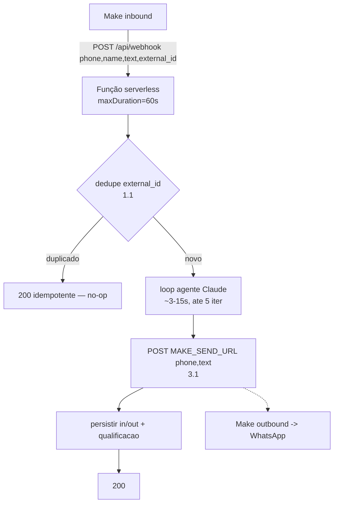

# ADR-002: Processamento do webhook em serverless — síncrono vs fila

## Status
**Accepted** — gate de design da Story [[../stories/backlog/3.3-api-webhook-idempotente|3.3]] (implementa após 3.1 + 3.2).

## Contexto

`/api/webhook` roda como função serverless na Vercel ([[ADR-001-serverless-vercel|Opção A]]). Fluxo de uma mensagem: **dedupe por `external_id` → loop do agente Claude → `sendText` via Make → persistir**.

O protótipo (`src/routes/webhook.ts`) responde `200` na hora e processa **depois** do return (fire-and-forget). Em serverless isso **não sobrevive**: a função congela ao retornar a resposta — o processamento pós-return é perdido (risco #2 de [[../project/architecture]]).

Fatos que pesam na decisão:
- **Latência do agente:** `claude-opus-4-8` com o loop agentic de `agent.ts` (até 5 iterações, mas tipicamente 1–2 chamadas; tools `atualizar_lead`/`transferir_para_humano`). Resposta típica na casa de **~3–15 s**; cauda possível mais alta em turnos com várias tools.
- **`maxDuration` Vercel:** até **60 s** (Hobby) e até **300 s** (Pro). Default baixo (10 s) — precisa ser declarado explicitamente.
- **Resposta ao lead NÃO usa o corpo do 200:** a mensagem de volta vai por um `POST {MAKE_SEND_URL}` separado durante o processamento ([[../stories/backlog/3.1-adapter-canal-make|3.1]]). O `200` só **ACK** a entrega do Make.
- **Make geralmente não bloqueia no 200:** o trigger "Custom webhook" responde por conta própria; nosso `200` não fica no caminho crítico de UX do lead.
- **Idempotência já existe:** `external_id` ([[../stories/backlog/1.1-idempotencia-external-id|1.1]]) torna reentregas/retries seguros — pré-condição que viabiliza o síncrono.
- **Volume:** SDR, baixo/médio. Sem necessidade de suavização de concorrência por enquanto.

## Opções consideradas

### A — Síncrono (processa antes do 200)
Dedupe → agente → `sendText` → persistir, tudo dentro da invocação, com `maxDuration` declarado.

- **Prós:** simples; uma função, um caminho; erros visíveis na própria invocação; sem infra extra; encaixa direto na 3.3.
- **Contras:** risco de **timeout** se a Claude entrar na cauda longa; sob carga concorrente alta, N invocações simultâneas (mas volume SDR não pressiona isso).

### A′ — Síncrono com `waitUntil` (refinamento)
ACK `200` rápido ao Make e continua o trabalho em `waitUntil(...)` (de `@vercel/functions`) dentro da **mesma** invocação/`maxDuration`.

- **Prós:** desacopla o ACK do trabalho; reduz a chance de o Make ver timeout no inbound.
- **Contras:** **não adiciona durabilidade** — se a função crashar no meio, o job se perde (sem retry); ainda conta contra `maxDuration`. É ergonomia, não robustez.

### B — Fila / async
Responder `200` rápido e enfileirar (tabela `jobs` no Supabase + cron, ou fila externa); um worker processa.

- **Prós:** robusto (at-least-once com retry/backoff); absorve picos; desacopla latência da Claude do ciclo de request.
- **Contras:** **mais complexidade** (tabela de jobs, worker, visibilidade/locking, retry, dedupe de job); a resposta ao lead ganha latência extra do intervalo do cron; over-engineering para o volume atual.

## Decisão

**Opção A — processamento síncrono, com `maxDuration = 60 s`.**

Justificativa: a latência típica (3–15 s) cabe com folga em 60 s; a idempotência por `external_id` neutraliza o principal risco do síncrono (retry do Make duplicando trabalho); a resposta ao lead não depende do corpo do `200`, então o síncrono não degrada UX; e a fila adiciona infra e latência de cron sem ganho real no volume de SDR. Alinha com a inclinação do lead.

`waitUntil` (A′) fica como **refinamento opcional** dentro da própria 3.3 se quisermos ACK mais rápido ao Make — mas sem ilusão de durabilidade.

## Consequências

**Positivas**
- 3.3 implementa um caminho único, testável; ACs já refletem processamento síncrono + dedupe.
- Sem infra adicional na Wave 2; menos superfície de falha agora.

**Negativas / mitigações**
- **Timeout na cauda da Claude:** declarar `maxDuration = 60`; manter o cap de 5 iterações do loop; se a etapa não exigir qualidade máxima, considerar `claude-sonnet-4-6`/`haiku` (já suportado por `AGENT_MODEL`) para baixar p95 — registrar como tuning, não como bloqueio.
- **Perda de job em crash:** aceitável porque o Make reentrega e o `external_id` deduplica; documentar que a entrega é "best-effort com reentrega do Make", não at-least-once próprio.

## Gatilhos para revisar (migrar para fila — Opção B)
Abrir novo ADR e migrar quando **qualquer** um ocorrer:
- p95 de processamento passar de **~40 s** (aproximando o teto de 60 s) de forma recorrente.
- Volume crescer a ponto de precisar suavizar concorrência / rate-limit de upstream.
- Entrar etapa lenta no pipeline (RAG, enriquecimento externo, geração de mídia).

**Caminho de migração:** a lógica de domínio (`handleInbound`) não muda — basta empacotá-la num worker disparado por uma `jobs` table + Vercel Cron (mesma mecânica da 3.4). Custo incremental baixo, decisão reversível.
