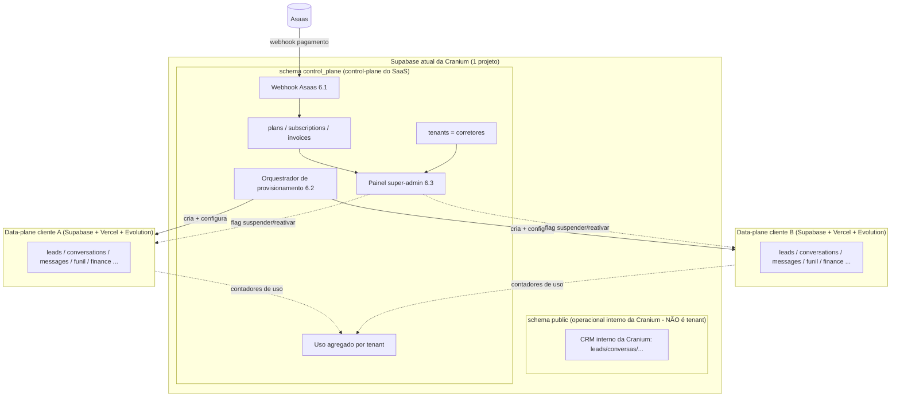

# ADR-008: Plano de controle central (control-plane) para o SaaS

## Status
**Accepted** (usuário, 2026-07-08). Introduz um conceito novo na arquitetura: um **plano de controle central (control-plane)** que conhece todos os clientes. Casado com [[ADR-007-gateway-pagamento-br]] (onde vive o billing) e pré-requisito das stories [[../stories/backlog/6.1-cobranca-assinatura]] e [[../stories/backlog/6.3-painel-super-admin]]. Define a ponte arquitetural para a Fase 5 ([[../stories/backlog/10.1-multi-tenant-db-compartilhado]]).

> **Refinamento (usuário, 2026-07-08):** o control-plane **não** é um projeto Supabase novo. Ele vive como um **schema separado dentro do Supabase atual** da Cranium (ex.: schema `control_plane`), isolado por permissões, distinto do schema `public` operacional. Ver revisão do ponto 1 da Decisão e do diagrama abaixo.
>
> **Guard-rail de produto:** a **instância/CRM da Cranium não é um tenant do SaaS** (ver [[../project/roadmap-saas]] § "Forma do produto SaaS"). O control-plane (schema `control_plane`) registra apenas os **corretores** (tenants do SaaS); a operação interna da Cranium roda no schema `public` do mesmo Supabase e nunca aparece na tabela `tenants`.

## Contexto

Este é o ponto arquitetural mais sensível da Fase 1. A tenancy atual é **"deploy por cliente"**: cada cliente é 1 projeto Supabase + 1 deploy Vercel isolado, provisionado pelo kit `provisioning/`. Não existe **nenhuma visão cross-cliente** - nada no sistema hoje conhece a lista de todos os clientes de uma vez.

Duas peças da Fase 1 exigem essa visão cross-cliente e não cabem em nenhum deploy individual:
- **Cobrança/assinatura (Asaas, 6.1):** o SaaS cobra vários clientes; as tabelas `plans/subscriptions/invoices` e o webhook do Asaas descrevem a base inteira, não um cliente.
- **Painel super-admin (6.3):** precisa listar todos os clientes com status, uso e ações de suspender/reativar.

Se essas peças fossem para dentro do deploy de cada cliente, não haveria de onde agregar a base - cada deploy só se enxerga. Daí a necessidade de um lugar central.

## Decisão

1. **Criar um plano de controle central (control-plane) como um schema separado dentro do Supabase atual** (ex.: schema `control_plane`, ao lado do `public` operacional). Ele é o único componente que conhece **todos os tenants (corretores)**. Não é o dado operacional de nenhum cliente nem da própria Cranium; é o registro da operação do SaaS. Optou-se por schema separado (e não projeto Supabase novo) para reduzir custo/operação de mais um projeto, mantendo o isolamento por permissões de schema e por service-role dedicada. A instância/CRM da Cranium continua no schema `public` do mesmo projeto e **não** é um tenant.

2. **O que vive no control-plane:**
   - **Registro de tenants (`tenants`):** a lista canônica de clientes, cada um com seus dados de deploy (URL do Supabase do cliente, URL do Vercel, instância Evolution, status geral).
   - **Billing (`plans`, `subscriptions`, `invoices`):** as tabelas de cobrança da 6.1 e o **webhook do Asaas** (ADR-007) apontam para cá.
   - **Provisionamento:** estado do provisionamento de cada tenant (idempotência, retry) que a 6.2 consome.
   - **Super-admin:** o painel da 6.3 lê e escreve aqui (lista de tenants + status de assinatura + ações suspender/reativar, com auditoria).
   - **Uso agregado (opcional/derivado):** indicadores de uso por cliente coletados dos deploys (ver relação com os data-planes abaixo).

3. **O que continua nos data-planes (deploys por cliente):** todo o domínio operacional do CRM - leads, conversations, messages, funnel, finance, demands, groups, meetings, email, config de integrações. Um deploy de cliente **não** conhece outros clientes; ele só conhece a si mesmo. O dado de negócio do cliente nunca sai do deploy dele por padrão.

4. **Como control-plane e data-planes se relacionam:**
   - **Provisionamento (6.2):** pagamento confirmado no Asaas → webhook no control-plane → control-plane cria a linha em `tenants` e dispara o provisionamento do data-plane (evolução do `provisioning/setup.ts` para rodar sob demanda). O control-plane guarda as credenciais/URLs do data-plane recém-criado.
   - **Suspensão/reativação:** inadimplência detectada no control-plane (webhook + reconciliação do Asaas) → o control-plane marca o tenant como `suspended` e sinaliza o data-plane (flag de suspensão que o middleware/guard do portal do cliente lê para bloquear acesso). Reativação segue o caminho inverso.
   - **Uso cross-cliente (6.3 AC3):** o control-plane **não tem** os dados operacionais. Para mostrar uso por cliente, ele **agrega por leitura** dos data-planes - via uma rota autenticada por deploy que expõe contadores (leads/mês, mensagens, última atividade), coletados por cron e materializados no control-plane. Não replicar dado operacional bruto; só métricas agregadas.

5. **Segurança:** as credenciais de service-role de cada data-plane ficam **só no control-plane** (server-side), nunca no client e nunca em outro data-plane. O super-admin (6.3) é um papel acima dos papéis de cliente (admin/atendente da story 5.2), autenticado forte e auditável. Um data-plane comprometido não dá acesso aos outros nem ao control-plane.

## Diagrama

## Evolução para a Fase 5 (banco compartilhado, [[../stories/backlog/10.1-multi-tenant-db-compartilhado]])

O control-plane é a **ponte natural** para o multi-tenant de banco compartilhado, não um trabalho jogado fora:
- Hoje, `tenants` aponta para N data-planes (N Supabase). Na Fase 5, os data-planes colapsam em **um único banco compartilhado com `org_id`**, e `tenants` vira essencialmente a tabela de `orgs` (a lista de organizações).
- O painel super-admin (6.3), que hoje **agrega por leitura de N deploys**, fica **trivial** no modelo compartilhado (é um `SELECT ... GROUP BY org_id` no mesmo banco). O código de agregação por leitura é descartável - o control-plane sobrevive, a fonte do uso é que muda.
- Billing (`plans/subscriptions/invoices`) e o registro de tenants **já estão centralizados** desde a Fase 1; na Fase 5 eles podem coexistir com (ou migrar para dentro do) banco compartilhado, mas o conceito não muda.
- O gatilho da Fase 5 provavelmente é o próprio onboarding automático (6.2): quando provisionar N Supabase por venda ficar caro/frágil demais, migra-se para "provisionar org = inserir linha", e o control-plane já está pronto para ser a autoridade de orgs.

## Alternativas descartadas

- **Colocar billing/super-admin dentro do deploy de um cliente "mestre":** descartada. Mistura dado operacional de um cliente com a operação do SaaS, quebra o isolamento e não escala (o "cliente mestre" viraria um god-deploy).
- **Antecipar já o banco compartilhado (Fase 5) para ter a visão cross-cliente de graça:** descartada. É a maior reforma do roadmap (10.1), arriscada (migração de dados de produção de N clientes) e prematura no volume atual. O control-plane entrega a visão cross-cliente **agora**, sem a reforma, e prepara o terreno para a Fase 5 quando o volume justificar.
- **Um serviço central sem banco (só orquestração via APIs dos data-planes):** descartada para o billing. Assinaturas/faturas precisam de um armazenamento durável e transacional próprio; depender de espalhar isso pelos data-planes reintroduz o problema de não ter fonte única.

## Trade-offs

- **Schema a mais no mesmo Supabase** (o `control_plane`) - aceito: evita operar mais um projeto Supabase (custo/backup/monitoramento separados), ao custo de o control-plane e o operacional interno compartilharem o mesmo projeto. Mitigação: isolamento por schema + service-role dedicada por schema + RLS; o backup do projeto já cobre os dois schemas. Se o volume/risco justificar no futuro, extrair para projeto dedicado é uma migração de schema, não de conceito.
- **Consistência eventual do uso agregado** - o uso cross-cliente é coletado por cron, então há defasagem. Aceitável para um painel de gestão (não precisa ser tempo real).
- **O control-plane guarda credenciais dos data-planes** - superfície sensível; concentrar o risco de segurança em um lugar bem protegido é preferível a espalhá-lo, mas exige rigor (secrets server-side, acesso auditado).
- **Acoplamento control-plane ↔ data-plane no provisionamento e na suspensão** - mitigado por contratos simples (flag de suspensão, rota de contadores) que sobrevivem à migração da Fase 5.

## Gatilho para reabrir
Revisar quando a Fase 5 ([[../stories/backlog/10.1-multi-tenant-db-compartilhado]]) for acionada: decidir se o control-plane absorve o banco compartilhado ou permanece separado dele. Também reabrir se a agregação de uso por leitura dos data-planes se mostrar frágil/cara antes da Fase 5 (pode antecipar parte da 10.1).
