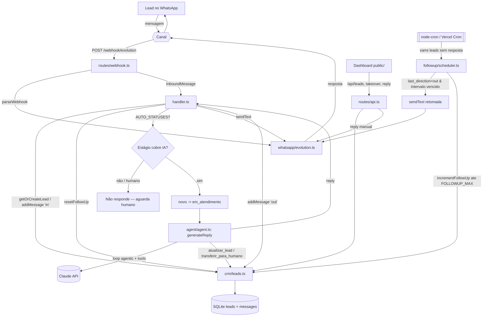
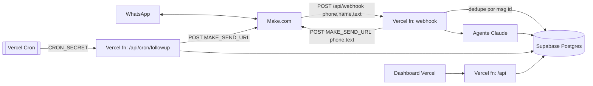

# Arquitetura — crm-whatsapp

Dois alvos: o **protótipo atual** (referência de lógica de negócio) e a **produção**
(Supabase + Vercel + Make). Mesma lógica de domínio, infra diferente. Ver [[modules]].

---

## Padrão atual (protótipo)

**Estilo:** monolito Express em camadas, processo único e longo (sobe via `index.ts`).

Camadas:
1. **Borda / Canal** — `routes/webhook.ts` recebe; `whatsapp/evolution.ts` parseia e envia.
2. **Orquestração** — `handler.ts` coordena o fluxo de uma mensagem.
3. **Inteligência** — `agent/agent.ts` (loop agentic + tools) + `agent/prompt.ts`.
4. **Domínio / Dados** — `crm/leads.ts` (repositório) sobre `db.ts` (SQLite), tipado por `types.ts`.
5. **Automação** — `followup/scheduler.ts` (`node-cron`, processo em memória).
6. **Operação humana** — `routes/api.ts` + dashboard estático em `public/`.

Características:
- Webhook responde **200 na hora** e processa em background (fire-and-forget).
- Follow-up é um **timer em memória** (`node-cron`) que varre o banco periodicamente.
- Estado 100% no **SQLite local** (arquivo `data/crm.db`, modo WAL).
- **Sem multi-tenant, sem auth, sem dedupe de mensagem.**

---

## Fluxo de dados: receber → IA → responder → persistir → follow-up

Pontos do fluxo que valem registrar:
- O **gate de `AUTO_STATUSES`** (`novo`, `em_atendimento`, `qualificado`) é o que pausa a IA quando um humano assume (`humano`) ou o lead avança (`proposta`/`fechado`/`perdido`).
- O **agente escreve no CRM durante o raciocínio** (tools → `updateLeadFields`). Qualificação e handoff são efeitos colaterais do loop, não retorno tratado pelo handler.
- O **follow-up zera** sempre que chega mensagem `in` (`resetFollowUp` no handler) e só dispara quando a **última direção foi `out`** — ou seja, nós falamos por último e o lead silenciou.

---

## Alvo de produção (serverless)

| Camada | Protótipo | Produção |
|---|---|---|
| Banco | SQLite (`db.ts`) | **Supabase / Postgres** (`@supabase/supabase-js`, service_role no server) |
| Hospedagem | Express, processo longo | **Vercel** (funções serverless) |
| Canal WhatsApp | Evolution API direta | **Make** como ponte (entrada e saída) |
| Follow-up | `node-cron` em memória | **Vercel Cron** → `/api/cron/followup` (auth por `CRON_SECRET`) |
| IA | Claude API | Claude API (igual; `claude-opus-4-8`, troca p/ `sonnet-4-6` no volume) |

Contrato do Make (decidido no CLAUDE.md):
- **Entrada:** WhatsApp → cenário Make → `POST {VERCEL_URL}/api/webhook` com `{ phone, name, text }`.
- **Saída:** Vercel → `POST {MAKE_SEND_URL}` com `{ phone, text }` → Make envia no WhatsApp.
- A Vercel **não fala com a Evolution diretamente**; o Make abstrai o canal.

---

## Pontos críticos da migração serverless

### 1. Cron sem processo longo
`node-cron` (`followup/scheduler.ts`) depende de um processo que nunca morre — **não existe na Vercel**. Solução: **Vercel Cron** (config em `vercel.json`) batendo em `/api/cron/followup`, protegida por `CRON_SECRET`. A função executa **um ciclo** de `runFollowUpCheck` por invocação. Pensar no **timeout de função** (varredura grande pode estourar) — paginar/limitar lote.

### 2. Webhook fire-and-forget não sobrevive
Hoje `webhook.ts` responde 200 e processa **depois** do return. Em serverless a função **congela ao retornar** — o processamento async é perdido. Opções: (a) processar **antes** de responder (síncrono, dentro do timeout); ou (b) enfileirar (ex.: tabela de jobs no Supabase + cron, ou fila externa). Para volume de SDR, síncrono dentro do limite costuma bastar.

### 3. Idempotência do webhook (HOJE NÃO EXISTE)
Make/Evolution podem **reentregar** a mesma mensagem. O protótipo **não deduplica** — reprocessaria, gerando resposta duplicada e mensagens repetidas no histórico. Produção precisa de **dedupe por id da mensagem** (coluna única / upsert idempotente). É pré-requisito antes de ligar o canal real.

### 4. Persistência: trocar o repositório, preservar contratos
Migrar `db.ts` + `crm/leads.ts` para Supabase **mantendo as assinaturas** das funções (`getOrCreateLead`, `addMessage`, `updateLeadFields`, etc.) isola o resto do código. Schema é autoridade da **crm-data** (ver `agents/data-engineer/schema`). Atenção a datas: hoje `parseSqliteDate` assume formato SQLite — com Postgres usar timestamptz nativo.

### 5. Concorrência / corrida no follow-up
Com cron serverless e webhook concorrentes, duas invocações podem agir sobre o mesmo lead. O contador `follow_up_count` e o gate `last_direction` precisam de **operações atômicas** no Postgres (update condicional) para não enviar retomada após o lead já ter respondido.

### 6. Multi-tenant, auth e segredos (futuro)
Protótipo é single-tenant sem auth. Produção: isolamento por conta (RLS no Supabase), **service_role só no servidor**, dashboard com Supabase Auth. Segredos (`ANTHROPIC_API_KEY`, `SUPABASE_SERVICE_ROLE_KEY`, `MAKE_SEND_URL`, `CRON_SECRET`) só em env da Vercel.

---

## ADRs pendentes (a registrar em `decisions/`)

- Modelo LLM por etapa do funil (opus vs sonnet vs haiku).
- Estratégia de processamento do webhook (síncrono vs fila).
- Mecanismo de idempotência/dedupe na borda.
- Memória/contexto do agente (histórico completo vs janela vs RAG) conforme conversas crescem.

> Decisões já fixadas no CLAUDE.md (canal via Make, Supabase, Vercel Cron) devem ser formalizadas como ADRs de aceite.
