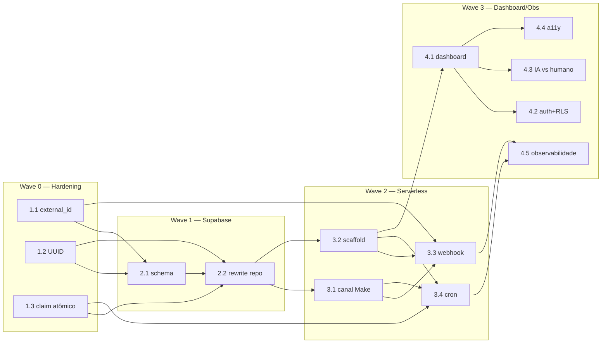
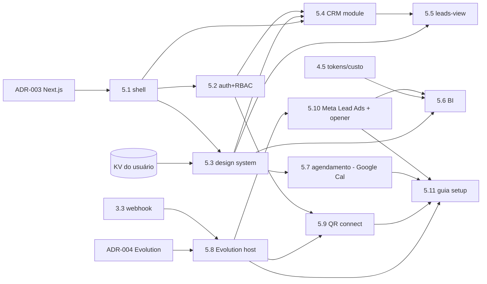

# Backlog de Stories — Migração Protótipo → Produção

Plano de migração (Express + SQLite → Supabase + Vercel + Make) organizado por **waves de dependência**.
Cada wave depende da anterior. Stories com `god-node: true` tocam arquivos centrais
(`types.ts`, `db.ts`, `crm/leads.ts`, `handler.ts`, `config.ts`) — exigem cuidado redobrado (modo `pre-flight`).

Fontes: [[../project/architecture]] (6 riscos serverless) · [[../project/modules]] (god nodes) · [[../agents/data-engineer/schema]] (gaps).

## Wave 0 — Hardening / pré-requisitos
> Base independente. Resolve riscos antes de migrar a infra. Toca god nodes.

| Story | Título | Complexidade | God node | Status | Agente |
|---|---|---|---|---|---|
| [[backlog/1.1-idempotencia-external-id\|1.1]] | Idempotência de mensagens por `external_id` | M | sim | backlog | — |
| [[backlog/1.2-lead-id-uuid\|1.2]] | Migrar `Lead.id`/`Message.id` para `string` (UUID) | M | sim | backlog | — |
| [[backlog/1.3-followup-update-atomico\|1.3]] | Update atômico no motor de follow-up | M | sim | backlog | — |

## Wave 1 — Persistência Supabase
> Depende da Wave 0. Provisiona e migra a camada de dados.

| Story | Título | Complexidade | God node | Status | Agente |
|---|---|---|---|---|---|
| [[backlog/2.1-supabase-projeto-schema\|2.1]] | Criar projeto Supabase e aplicar schema | S | não | backlog | — |
| [[backlog/2.2-rewrite-persistencia-supabase\|2.2]] | Reescrever `db.ts` + `crm/leads.ts` para Supabase | L | sim | backlog | — |

## Wave 2 — Serverless Vercel
> Depende da Wave 1. Rotas Express → funções `/api`; canal Make; cron.

| Story | Título | Complexidade | God node | Status | Agente |
|---|---|---|---|---|---|
| [[backlog/3.1-adapter-canal-make\|3.1]] | Adapter de canal — Evolution → Make | M | sim | backlog | — |
| [[backlog/3.2-scaffold-serverless-vercel\|3.2]] | Scaffold serverless — rotas → funções `/api` | L | não | backlog | — |
| [[backlog/3.3-api-webhook-idempotente\|3.3]] | `/api/webhook` idempotente (Make → agente → resposta) | L | sim | backlog | — |
| [[backlog/3.4-api-cron-followup\|3.4]] | `/api/cron/followup` + Vercel Cron (`CRON_SECRET`) | M | não | backlog | — |

## Wave 3 — Dashboard + Observabilidade
> Depende da Wave 2. Front em produção, segurança e operação.

| Story | Título | Complexidade | God node | Status | Agente |
|---|---|---|---|---|---|
| [[backlog/4.1-dashboard-vercel\|4.1]] | Dashboard na Vercel | M | não | backlog | — |
| [[backlog/4.2-auth-supabase-rls\|4.2]] | Autenticação do dashboard + RLS | L | não | backlog | — |
| [[backlog/4.3-distinguir-ia-vs-humano\|4.3]] | Distinguir mensagem de IA vs humano | M | sim | backlog | — |
| [[backlog/4.4-a11y-drawer\|4.4]] | Acessibilidade do drawer de conversa | S | não | backlog | — |
| [[backlog/4.5-observabilidade-rate-limiting\|4.5]] | Observabilidade e rate limiting | L | não | backlog | — |

## Grafo de dependências (waves)

## Resumo (Epics 1–4 — migração)
- **14 stories** em 4 waves: Wave 0 (3) · Wave 1 (2) · Wave 2 (4) · Wave 3 (5).
- **7 god-node stories** (modo `pre-flight`): 1.1, 1.2, 1.3, 2.2, 3.1, 3.3, 4.3.
- Complexidade: S(2) · M(7) · L(5) · XL(0).

---

# Epic 5 — Portal interno multi-módulo

Nova direção (usuário, 2026-06-25): CRM → **portal da equipe interna** da Cranium. O backend (Supabase + serverless + agente IA + WhatsApp) vira **fundação**; o CRM vira módulo. Decisões **accepted**: [[../decisions/ADR-003-portal-nextjs]] (front → Next.js App Router) e [[../decisions/ADR-004-canal-whatsapp-qr-vs-make]] (**DECISÃO FINAL: canal = Evolution auto-hospedada; Make dropado de tudo; agendamento via Google Calendar direto; aquisição via Meta Lead Ads (formulário instantâneo) outbound-first**). Princípio: minimizar o esforço do **usuário** (escaneia 1 QR + conecta Google + cria anúncio com formulário; nós hospedamos/mantemos).

## Wave P0 — Fundação do Portal
> Shell + auth + branding. Base de todos os módulos.

| Story | Título | Complexidade | God node | Status | Agente |
|---|---|---|---|---|---|
| [[backlog/5.1-portal-nextjs-shell\|5.1]] | Shell do portal em Next.js App Router | XL | não | backlog | — |
| [[backlog/5.2-auth-rbac-interno\|5.2]] | Auth interno + RBAC (Supabase Auth SSR + RLS por papel) | L | não | backlog | — |
| [[5.3-design-system-branded\|5.3]] | Design system branded (KV) | L | não | active | — |

## Wave P1 — Migrar CRM para o portal
> Depende da P0. Porta o que já existe.

| Story | Título | Complexidade | God node | Status | Agente |
|---|---|---|---|---|---|
| [[backlog/5.4-modulo-crm-kanban\|5.4]] | Módulo CRM/kanban no portal | M | não | backlog | — |
| [[backlog/5.5-aba-leads-rica\|5.5]] | Aba rica de visualização de leads | L | não | backlog | — |

## Wave P2 — Módulos novos
> Depende da P0 (e P1 p/ contexto de leads). Módulos podem ir em paralelo entre si.

| Story | Título | Complexidade | God node | Status | Agente |
|---|---|---|---|---|---|
| [[backlog/5.6-modulo-metricas-bi\|5.6]] | Métricas & BI | L | não | backlog | — |
| [[backlog/5.7-modulo-agendamento\|5.7]] | Agendamento de reuniões (Google Calendar direto) | L | sim | backlog | — |
| [[backlog/5.8-evolution-self-hosted\|5.8]] | Provisionar Evolution auto-hospedada + re-rota do canal | L | sim | backlog | — |
| [[backlog/5.9-whatsapp-connect-qr\|5.9]] | Conectar WhatsApp via QR no portal | M | não | backlog | — |
| [[backlog/5.10-meta-lead-ads\|5.10]] | Integração Meta Lead Ads (form instantâneo) + opener outbound | L | sim | backlog | — |
| [[backlog/5.11-guia-setup-evolution-leadads\|5.11]] | Guia de setup (Evolution + Meta Lead Ads + Google Calendar) (doc) | S | não | backlog | — |

> **Decisão final ADR-004 (Evolution, Make dropado):** a 3.1 (adapter→Make) sai do caminho; a borda do canal volta a Vercel↔Evolution direto (encapsulado em 5.8 + ajuste do `/api/webhook`). Make removido também do agendamento (5.7 usa Google Calendar direto).

## Grafo de dependências (Epic 5)

## Re-escopo de stories da Wave 3 (efeito do Epic 5)
> O portal absorve/reescopa stories do epic 4 — evitar trabalho duplicado:

| Story 4.x | Destino |
|---|---|
| 4.1 dashboard estático na Vercel | **Superseded** por 5.1 (shell Next.js) |
| 4.2 auth + RLS | **Absorvida** por 5.2 (auth+RBAC do portal) |
| 4.3 distinguir IA vs humano | **Mantida** — concern de dados; alimenta 5.4/5.5 |
| 4.4 a11y do drawer | **Absorvida** por 5.3/5.4 |
| 4.5 observabilidade + tokens/custo | **Mantida** — pré-requisito do BI (5.6) |
| 4.6 redesign visual dashboard | **Absorvida** por 5.3 (design system) |

## Resumo (Epic 5 — portal)
- **11 stories** em 3 waves: P0 (3) · P1 (2) · P2 (6).
- **3 god-node stories** (`pre-flight`): 5.7 (gatilho de qualificação), 5.8 (borda de canal/webhook), 5.10 (Lead Ads: cria lead + opener outbound; toca tipos/intake/envio). 5.1/5.2 também em `pre-flight` por raio de impacto (não-god-node).
- Complexidade: S(1) · M(2) · L(7) · XL(1).
- **ADRs accepted:** 003 (Next.js) e 004 (**FINAL: Evolution auto-hospedada; Make dropado de tudo; Google Calendar direto no agendamento; aquisição via Meta Lead Ads / formulário instantâneo, outbound-first**).
- **Bloqueios:** 5.3 bloqueada pelo KV do usuário; P2 depende de P0; 5.8 re-rota o `/api/webhook` (3.3 entregue) para payload da Evolution; 5.9/5.10/5.11 dependem de 5.8.

## Follow-ups / Tech-debt (de QA)
> Itens não-bloqueantes levantados em review. Endereçar em hardening futuro.

- **[TEST] Regressão de idempotência (de 1.1, god-node):** repo não tem suíte nem script `test`. AC4 fechado por verificação manual do QA. Criar teste automatizado (2x payload → 1 linha em `messages` + 1 envio). Idealmente junto de uma story maior de *testing strategy* (a definir) — relevante para qualidade de produção.
- **[NIT] `src/db.ts` catch amplo na migração ALTER:** `catch {}` engole qualquer erro, não só "duplicate column". Tornar específico. Baixa severidade — pode ser absorvido na 1.2/2.2 enquanto se mexe em db.ts.
