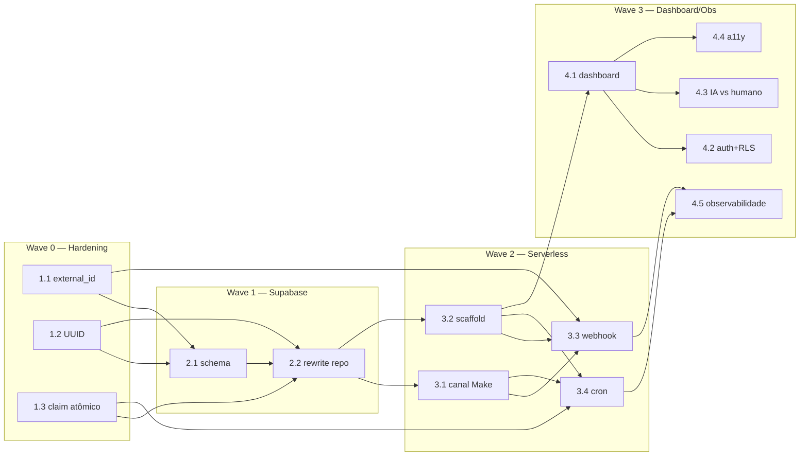

# Backlog de Stories — Migração Protótipo → Produção

Plano de migração (Express + SQLite → Supabase + Vercel + Make) organizado por **waves de dependência**.
Cada wave depende da anterior. Stories com `god-node: true` tocam arquivos centrais
(`types.ts`, `db.ts`, `crm/leads.ts`, `handler.ts`, `config.ts`) — exigem cuidado redobrado (modo `pre-flight`).

Fontes: [[../project/architecture]] (6 riscos serverless) · [[../project/modules]] (god nodes) · [[../agents/data-engineer/schema]] (gaps).

## Wave 0 — Hardening / pré-requisitos
> Base independente. Resolve riscos antes de migrar a infra. Toca god nodes.

| Story | Título | Complexidade | God node | Status | Agente |
|---|---|---|---|---|---|
| [[backlog/1.1-idempotencia-external-id\|1.1]] | Idempotência de mensagens por `external_id` | M | sim | backlog | — |
| [[backlog/1.2-lead-id-uuid\|1.2]] | Migrar `Lead.id`/`Message.id` para `string` (UUID) | M | sim | backlog | — |
| [[backlog/1.3-followup-update-atomico\|1.3]] | Update atômico no motor de follow-up | M | sim | backlog | — |

## Wave 1 — Persistência Supabase
> Depende da Wave 0. Provisiona e migra a camada de dados.

| Story | Título | Complexidade | God node | Status | Agente |
|---|---|---|---|---|---|
| [[backlog/2.1-supabase-projeto-schema\|2.1]] | Criar projeto Supabase e aplicar schema | S | não | backlog | — |
| [[backlog/2.2-rewrite-persistencia-supabase\|2.2]] | Reescrever `db.ts` + `crm/leads.ts` para Supabase | L | sim | backlog | — |

## Wave 2 — Serverless Vercel
> Depende da Wave 1. Rotas Express → funções `/api`; canal Make; cron.

| Story | Título | Complexidade | God node | Status | Agente |
|---|---|---|---|---|---|
| [[backlog/3.1-adapter-canal-make\|3.1]] | Adapter de canal — Evolution → Make | M | sim | backlog | — |
| [[backlog/3.2-scaffold-serverless-vercel\|3.2]] | Scaffold serverless — rotas → funções `/api` | L | não | backlog | — |
| [[backlog/3.3-api-webhook-idempotente\|3.3]] | `/api/webhook` idempotente (Make → agente → resposta) | L | sim | backlog | — |
| [[backlog/3.4-api-cron-followup\|3.4]] | `/api/cron/followup` + Vercel Cron (`CRON_SECRET`) | M | não | backlog | — |

## Wave 3 — Dashboard + Observabilidade
> Depende da Wave 2. Front em produção, segurança e operação.

| Story | Título | Complexidade | God node | Status | Agente |
|---|---|---|---|---|---|
| [[backlog/4.1-dashboard-vercel\|4.1]] | Dashboard na Vercel | M | não | backlog | — |
| [[backlog/4.2-auth-supabase-rls\|4.2]] | Autenticação do dashboard + RLS | L | não | backlog | — |
| [[backlog/4.3-distinguir-ia-vs-humano\|4.3]] | Distinguir mensagem de IA vs humano | M | sim | backlog | — |
| [[backlog/4.4-a11y-drawer\|4.4]] | Acessibilidade do drawer de conversa | S | não | backlog | — |
| [[backlog/4.5-observabilidade-rate-limiting\|4.5]] | Observabilidade e rate limiting | L | não | backlog | — |

## Grafo de dependências (waves)

## Resumo
- **14 stories** em 4 waves: Wave 0 (3) · Wave 1 (2) · Wave 2 (4) · Wave 3 (5).
- **7 god-node stories** (modo `pre-flight`): 1.1, 1.2, 1.3, 2.2, 3.1, 3.3, 4.3.
- Complexidade: S(2) · M(7) · L(5) · XL(0).

## Follow-ups / Tech-debt (de QA)
> Itens não-bloqueantes levantados em review. Endereçar em hardening futuro.

- **[TEST] Regressão de idempotência (de 1.1, god-node):** repo não tem suíte nem script `test`. AC4 fechado por verificação manual do QA. Criar teste automatizado (2x payload → 1 linha em `messages` + 1 envio). Idealmente junto de uma story maior de *testing strategy* (a definir) — relevante para qualidade de produção.
- **[NIT] `src/db.ts` catch amplo na migração ALTER:** `catch {}` engole qualquer erro, não só "duplicate column". Tornar específico. Baixa severidade — pode ser absorvido na 1.2/2.2 enquanto se mexe em db.ts.
